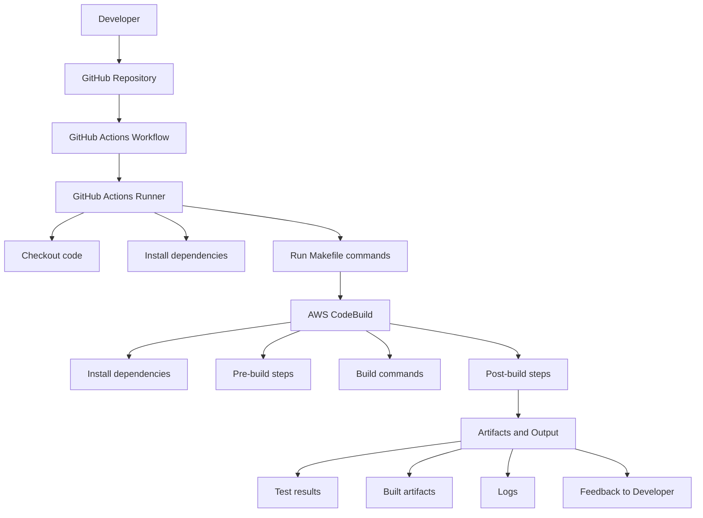

# GitHub Actions Demo

This repository demonstrates building **CI/CD pipelines** using **GitHub Actions**, **AWS CodeBuild**, and related tools. It serves as a reference for learning CI/CD concepts and best practices.

## 📝 Project Themes

This repo covers key CI/CD concepts:

- **Makefile** with commands like `install`, `lint`, `test`
- **GitHub Actions workflows** (`.github/workflows/*.yml`)
- **Dockerfile** and **ECS deployment**
- **AWS CodeBuild** integration with `buildspec.yml`
- **Locust** library for full CI/CD pipelines

## ⚡ Setup Instructions

1. **Create a virtual environment**
```bash
python3 -m venv ~/.github-actions-demo
```

2. **Activate the virtual environment**
```bash
source ~/.github-actions-demo/bin/activate
```

3. **Install dependencies** (if any)
```bash
pip install -r requirements.txt
```

4. **Run Makefile commands**
```bash
make install
make lint
make test
```

## 🚀 CI/CD Pipeline Diagram

This diagram shows the flow from **code push** to **artifacts and feedback**, including **GitHub Actions** and **AWS CodeBuild**.



## 📂 Key Files in the Repo

| File | Purpose |
|------|---------|
| `Makefile` | Defines `install`, `lint`, `test`, `build` commands |
| `.github/workflows/*.yml` | GitHub Actions workflows |
| `Dockerfile` | Containerize the project |
| `buildspec.yml` | AWS CodeBuild instructions |
| `requirements.txt` | Python dependencies |

## 🔑 Notes

- GitHub Actions handles automatic builds and tests on push or PR.
- AWS CodeBuild runs builds, tests, and Docker image creation.
- ECR stores Docker images.
- ECS deploys Docker images as running containers.
- S3 (optional) can store logs, artifacts, or test reports.
- The setup can be extended to ECS services, Lambda, or other AWS deployments.